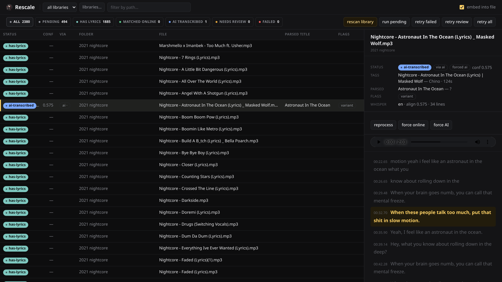
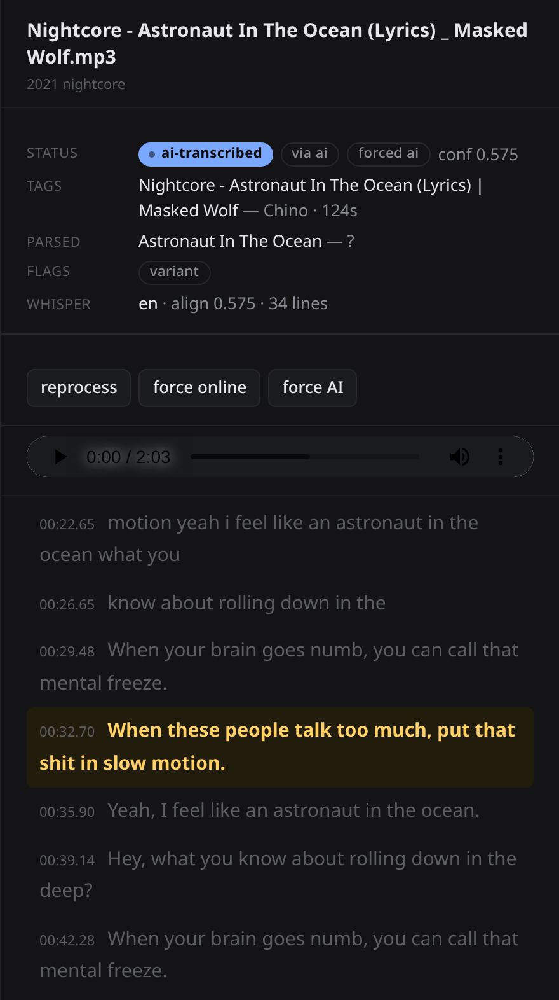
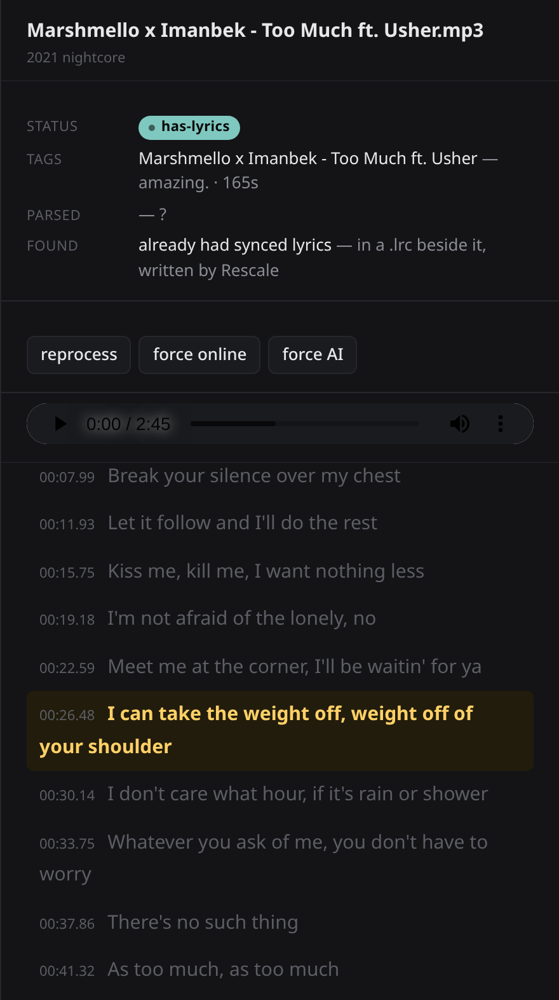
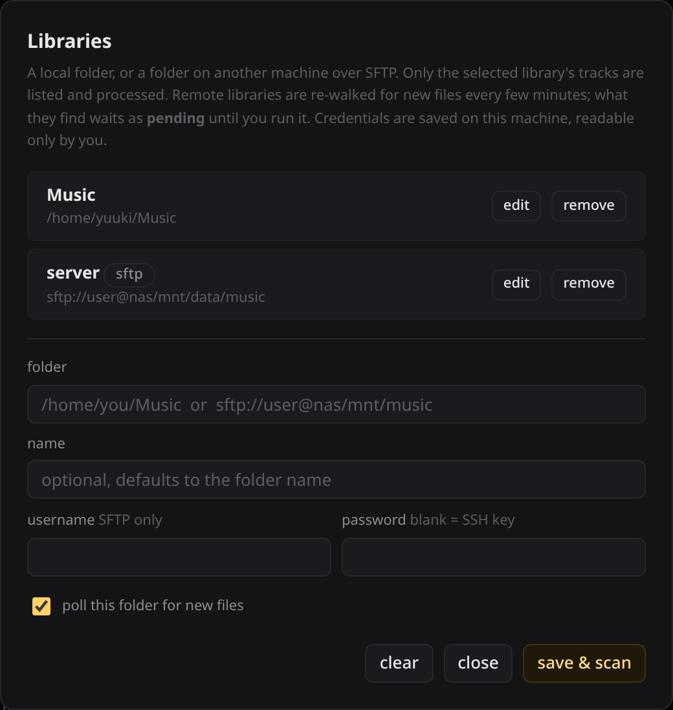

<div align="center">


# Rescale

**Every track in your library gets synced lyrics. No exceptions.**

Point it at your music folders — local or over SFTP — and it scans, finds synced lyrics online,
rescales the timestamps for nightcore and sped-up edits, and transcribes the rest locally with
Demucs + WhisperX. The lyrics land in each file's own tag, ready for Navidrome.

[](https://www.python.org/)
[](https://docs.astral.sh/uv/)
[](https://fastapi.tiangolo.com/)
[](https://github.com/m-bain/whisperX)
[](https://www.sqlite.org/)
[](https://developer.nvidia.com/cuda-toolkit)

</div>

---

## Screenshots

<table>
<tr>
<td colspan="3">

**Library** — every track, its status, confidence and which path picked it up, next to the player and its live-highlighting lyrics


</td>
</tr>
<tr>
<td width="33%">

**AI path** — Whisper language, alignment score, transcribed and force-aligned lyrics


</td>
<td width="33%">

**Already done** — a scan that found synced lyrics already on the file leaves it alone, and still plays them


</td>
<td width="33%">

**Libraries** — local folders and SFTP boxes, each scanned and scoped separately


</td>
</tr>
</table>

## Why "Rescale"

A synced lyric file is a list of timestamps, and those timestamps only mean something for the exact audio they were built against. Speed up a track for a nightcore edit, slow it down, trim the intro — the words are unchanged but every timestamp now points at the wrong second. Rescale's job is exactly what the name says: measure how a track's timeline diverges from the original and stretch or compress the timestamps to fit it, whether that's a sped-up edit, a slowed one, or anything else whose timing doesn't match the source.

## How it works

```
scan ──> decide ──┬── online ──> LRCLIB lookup ──> verify against the audio ──> rescale ──┐
                  │                                                                       ├──> lyrics tag / .lrc
                  └── ai ──────> Demucs vocals ──> WhisperX ──> forced alignment ─────────┘
```

Every track picks one of two paths automatically, and you can override it per track:

- **online** — parses the real title and artist out of YouTube-rip filenames
  (`Nightcore - X (Lyrics) | Uploader`), looks the song up on [LRCLIB](https://lrclib.net), then
  **measures the actual speed change and lead-in trim from your copy of the audio** and rescales
  every timestamp to match. A 1.25× nightcore edit lines up to the word.
- **ai** — Demucs separates the vocal stem, WhisperX transcribes and force-aligns it, entirely
  local, on GPU if you have one. Used for covers, remixes, obscure tracks with no online match, and
  anything you point at it by hand.

The online path doesn't trust a title match: it runs a quick transcript of the vocal stem and scores
every candidate on how much of it it actually heard. Wrong song, heavily cut edit, nonsense timing
fit — all of it falls through to the AI path instead of writing garbage.

## Features

- 🎯 **Two paths, chosen per track** — online lookup where it's right, local AI where it isn't, `prefer` to override
- ⏱ **Timestamp rescaling** — nightcore, sped up, slowed, daycore: speed *and* offset measured from the audio, not guessed from a duration ratio
- 🎧 **Audio verification** — every online candidate is scored against a Whisper transcript of the vocal stem before it's accepted
- 🧠 **Local transcription** — Demucs `htdemucs` + WhisperX `large-v3` with word-level forced alignment, no API keys, nothing leaves the box
- 🔍 **Filename parsing** — strips `(Lyrics)`, `[Official Video]`, uploader suffixes and the rest of the YouTube-rip noise
- 📊 **Confidence gating** — low-confidence results land in `needs-review` instead of silently shipping wrong lyrics
- ⏭ **Nothing done twice** — a scan notices tracks that already carry synced lyrics, from an earlier run or from the source, and leaves them alone
- 🖥 **Web UI** — browse by status, filter by path, play a track with its lyrics highlighting live, click a line to seek, reprocess in one click
- 🌐 **Remote libraries** — point it at `sftp://user@host/music` and it processes a NAS or Navidrome box over the network, pushing the lyrics back
- 🔒 **Read-only library** — the *only* thing ever written into your music tree is the lyrics: into the file's own tag, backed up and verified, or as an atomically-written `.lrc` sidecar
- 🐳 **Docker + GPU** — CUDA 12.8 image, or drop the GPU block and run on CPU
- 📦 **All state in `data/`** — db, LRCLIB cache, model weights, vocal stems, logs, one folder, delete it to start over

## Tech Stack

| Layer | Choice |
|---|---|
| Runtime & packaging | Python 3.12, [uv](https://docs.astral.sh/uv/) workspace |
| Backend | FastAPI + SQLModel, SQLite |
| Frontend | One `index.html`, no build step |
| Lyrics source | [LRCLIB](https://lrclib.net) |
| ML | [WhisperX](https://github.com/m-bain/whisperX) (`large-v3`) + [Demucs](https://github.com/adefossez/demucs) (`htdemucs`), torch cu128 |
| Audio | FFmpeg |

## Quick Start

```sh
uv sync                       # ~5 GB: torch cu128 + whisperx + demucs
uv run rescale scan --report  # dry run: extensions, tag quality, sample rows
uv run rescale scan           # populate data/db/rescale.sqlite3
uv run rescale run --limit 5  # process 5 tracks, write their lyrics
uv run rescale run            # everything pending (models download on the first AI track)
uv run rescale serve          # http://localhost:8765
```

### Libraries

*libraries…* in the web UI manages the list: a local folder, or `sftp://user@nas/mnt/data/music` with
a username and password. Each one is walked recursively and scanned separately, and the library picker
scopes everything downstream — the track list, the per-status counts, and every run button. Which
tracks belong to which library is derived from their path, so adding a folder adopts whatever was
already scanned under it.

The list lives in `data/config/libraries.json` (mode `0600`, since SFTP passwords are in it). From the
CLI, `rescale scan --root /path/to/music` points the first local library somewhere else, and
`rescale libraries` prints them. `RESCALE_LIBRARY_ROOT=/music` overrides the first local one, which is
how the Docker image finds its mount.

**Remote libraries** are for a Navidrome box whose music lives on another machine. Scanning one never
downloads it: tags live at the head and tail of an audio file, so the scanner fetches just those two
windows per track rather than streaming the audio. A track is only pulled into `data/remote/` when it
is actually processed, and the result is pushed back over the original. Every `[library] poll_minutes`
(15 by default) each remote library is re-walked for new files — they appear as `pending` and stay
there, since nothing reaches the GPU until you run it. The UI player streams remote tracks by byte
range, so seeking doesn't wait on the whole file.

## Commands

```sh
uv run rescale status                               # counts per status
uv run rescale libraries                            # the configured libraries
uv run rescale run --retry-failed --redo-review     # widen what "run" picks up
uv run rescale run --filter "Will Stetson"          # only paths containing a substring
uv run rescale prefer ai --filter "nightcore is B)" # force a path, mark those tracks pending
uv run pytest
```

**Statuses:** `pending` → `matched-online` | `ai-transcribed` | `needs-review` (written, but below
the accept threshold, or the transcript only half-agreed with it) | `failed`. Re-runs skip everything
that isn't pending.

`has-lyrics` is the sixth: the file already had synced lyrics when it was scanned, so there is nothing
to do. Scanning checks the file's lyrics tag and any `.lrc` beside it, and adopts what it finds —
whether Rescale wrote it on an earlier run (the `[re:Rescale]` stamp says which) or the file came with
it. Unsynced lyrics don't count: a plain lyric dump is what Rescale exists to replace. This is what
stops a cleared database, a restored backup or an rsync from putting a whole library back through the
GPU; to redo one anyway, use *reprocess* on the track.

**Where the lyrics go:** into the audio file's own lyrics tag by default — `USLT` for mp3/wav, `LYRICS`
for flac/ogg/opus, `©lyr` for m4a — which is what Navidrome reads. Untick *embed into file* in the UI
(or set `[writer] embed = false`) to get a `<basename>.lrc` sidecar instead. Embedding backs the file
up, and for mp3 checks the audio stream is byte-for-byte identical afterwards, before dropping the backup.

**Disk:** the only thing `data/` keeps per track is its row in SQLite — lyrics, timings, match details.
The separated vocal stem is deleted once the track has been transcribed; they are uncompressed wav,
a few hundred MB each, and kept for a whole library they run to tens of GB. Set
`[transcriber] keep_stems = true` if you are re-running transcription over the same tracks repeatedly
and want to skip Demucs each time. Model weights in `data/models/` are the other big folder (~13 GB)
and are re-downloaded if removed.

**Config:** `config/default.toml`. Any key overrides via `RESCALE_<SECTION>_<KEY>` —
`RESCALE_LIBRARY_ROOT=/music`, `RESCALE_TRANSCRIBER_DEVICE=cpu`,
`RESCALE_TRANSCRIBER_BATCH_SIZE=4` if WhisperX OOMs next to Demucs.

## API

| Method | Route | Does |
|---|---|---|
| `GET` | `/api/stats` | counts per status |
| `GET` | `/api/tracks?status=&q=` | list, filterable by status and path substring |
| — | *(every route above takes `?lib=<id>` to scope it to one library)* | |
| `GET` | `/api/tracks/{id}` | one track with its lyrics |
| `GET` | `/api/tracks/{id}/audio` | stream the file for the UI player, byte ranges and all, remote tracks included |
| `POST` | `/api/tracks/{id}/reprocess?path=auto\|online\|ai` | requeue one track on a given path |
| `POST` | `/api/run?status=pending\|failed\|needs-review\|all` | kick the background worker |
| `POST` | `/api/scan` | rescan one library, or all of them |
| `GET` | `/api/libraries` | the configured libraries, without their passwords |
| `POST` | `/api/libraries` | `{url, name, username, password, auto_scan}`: add or edit one, validated before it is saved |
| `DELETE` | `/api/libraries/{id}` | forget a library and the tracks scanned from it |

## Docker

```sh
docker compose up -d --build
```

Edit the library mount in `compose.yaml` (`RESCALE_LIBRARY_ROOT` already points at where it lands).
On a machine without an NVIDIA GPU, drop the
`deploy.resources` block and set `RESCALE_TRANSCRIBER_DEVICE=cpu` — expect roughly real-time or
slower per track on the AI path.

## Project Structure

One uv workspace package per pipeline stage, ~1900 lines across them.

```
rescale/
├── packages/
│   ├── core/          # config + library registry + SQLModel schema + session
│   ├── scanner/       # read-only library walk, tag reading, upsert
│   ├── matcher/       # filename/tag parsing, LRCLIB search + cache, similarity scoring
│   ├── rescaler/      # pure timestamp math: parse, fit speed/offset, rescale, rebuild
│   ├── transcriber/   # Demucs stem separation, WhisperX transcribe + align
│   ├── writer/        # atomic sidecar write + embedded lyrics tags
│   └── api/           # pipeline orchestration, CLI, FastAPI app
├── frontend/          # index.html: track list, player, live-highlighting lyrics
├── config/            # default.toml
├── tests/
└── data/              # db, caches, model weights, logs (gitignored)
```
